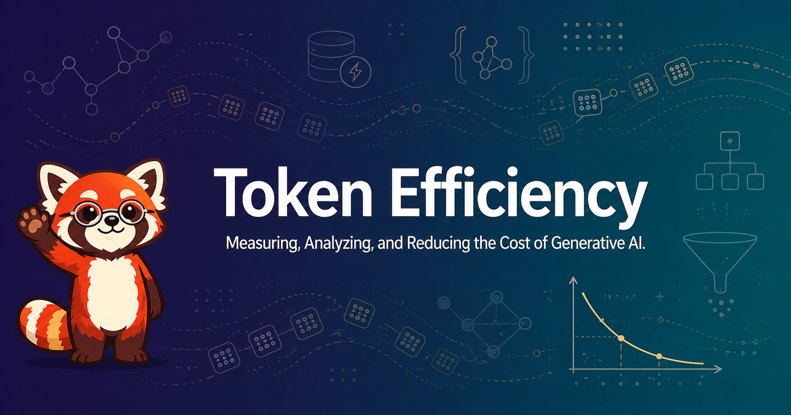

# Welcome

<figure markdown>
  { width="100%" }
</figure>

Welcome to **Token Efficiency** — a practical, open-source intelligent textbook on measuring, analyzing, and reducing the cost of generative AI.

!!! mascot-welcome "Every Token Counts — and Counting Is Fun"
    
    Hi, I'm Pemba — your guide. We're going to look at where the tokens in modern AI systems actually go, why your bill is what it is, and how to drive it down without sacrificing quality. Cheap systems are happy systems. Let's count some tokens.

## About This Book

In many organizations today, the token usage costs of generative AI tools are becoming a dominant factor in operating expenses. A single poorly-designed prompt, a verbose system message, an unbounded context window, or an over-eager agent loop can multiply costs by ten or one hundred times without producing better outcomes. Yet very few engineers and managers have a rigorous, end-to-end understanding of where tokens come from, how they are billed, and how to systematically drive them down without hurting quality.

This course closes that gap. It begins with a clear, practical mental model of how large language models consume input and output tokens, and builds up — through pricing economics, vendor ecosystems, agentic harnesses, structured logging, dashboards, A/B testing, prompt engineering, prompt caching, RAG tuning, context window management, model routing, and agent budget policies — to a complete, defensible token-efficiency operating model you can run on your own systems.

The book is **deliberately vendor-pluralistic**. It covers the three dominant ecosystems that engineering teams encounter today — Anthropic Claude, OpenAI, and Google Gemini — side by side, so you can compare them on cost-quality tradeoffs and design vendor-neutral abstractions where appropriate.

## What You'll Find Inside

- **20 chapters** organized in prerequisite order, from token mechanics through capstone projects
- **475 interconnected concepts** in a validated learning graph that guarantees no chapter introduces a term before its prerequisites
- **40+ interactive MicroSims** — browser-based simulations for the tokenizer pipeline, cache hit-rate dynamics, the Pareto frontier, agent budget meters, and more
- **End-of-chapter quizzes** that test understanding at the appropriate Bloom's Taxonomy level
- **Cited references** linking to vendor documentation and authoritative sources
- **Pemba the Red Panda**, the book's pedagogical mascot, who shows up at the moments you need her most

## Who This Book Is For

The primary audience:

- **Software engineers** building features on top of LLM APIs
- **Machine learning engineers** and platform engineers responsible for generative AI infrastructure
- **Technical leads and engineering managers** who own the cost and performance of AI features in production
- **FinOps practitioners** translating LLM bills into per-feature, per-user, and per-outcome unit economics

Secondary audience:

- **Graduate students** in computer science, data science, or information systems who want practical exposure to the economics of large language models

**Prerequisites:** working knowledge of one programming language (Python preferred), familiarity with REST APIs and JSON, basic command-line and Git skills, and conceptual exposure to LLMs at the level of *"I have used ChatGPT, Claude, or a similar tool."*

## How to Use This Book

Use the navigation menu on the left to explore:

- **[Chapters](chapters/index.md)** — main educational content, designed to be read in order
- **[MicroSims](sims/index.md)** — interactive simulations referenced throughout the chapters
- **[Case Studies](case-studies/index.md)** — applied examples and worked dashboards
- **[Learning Graph](learning-graph/index.md)** — interactive concept-dependency visualization across all 475 concepts
- **[About](about.md)** — author bio, citation formats, license, and the motivation behind the book

If you're new to LLM economics, read the chapters in order — each one builds on the prior. If you're already familiar with the basics, skim Chapters 1–3 and jump to whichever optimization technique matches your current backlog.

## Getting Started

Start with **[Chapter 1: LLMs, Tokens, and Generation Basics](chapters/01-llms-tokens-generation-basics/index.md)** to install the mental model the rest of the book depends on. By the end of Chapter 3 you'll be able to read any LLM API call and predict its cost. By the end of Chapter 14 you'll know how to cache it. By the end of Chapter 18 you'll know how to budget it.

## License

This work is released under the [Creative Commons Attribution-NonCommercial-ShareAlike 4.0 International License (CC BY-NC-SA 4.0)](https://creativecommons.org/licenses/by-nc-sa/4.0/). Source code, MicroSim implementations, and supporting scripts are available under the same terms in the [project repository](https://github.com/dmccreary/token-efficiency).
