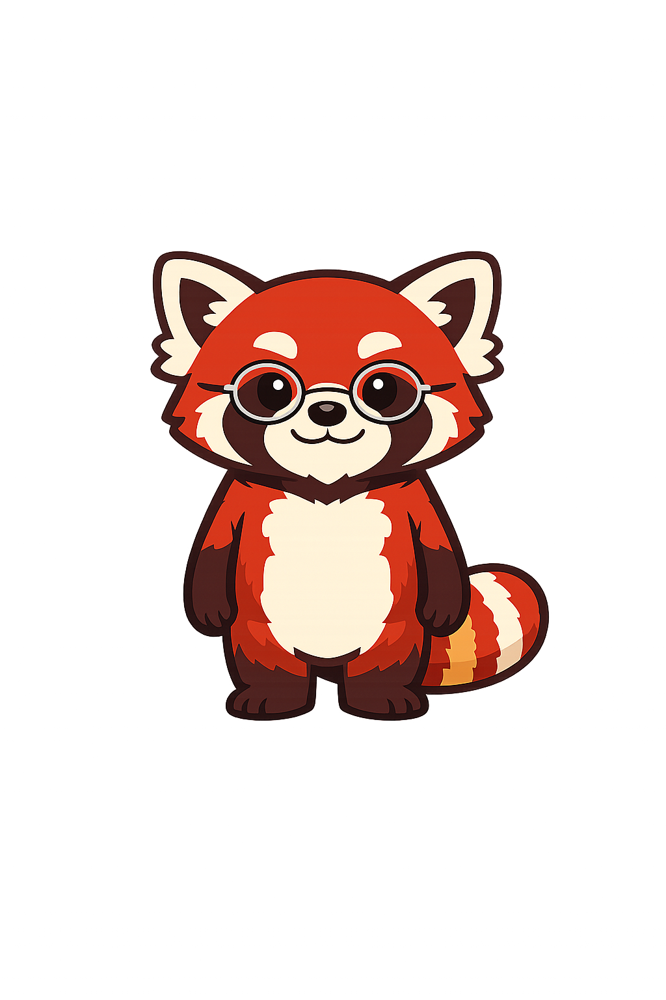
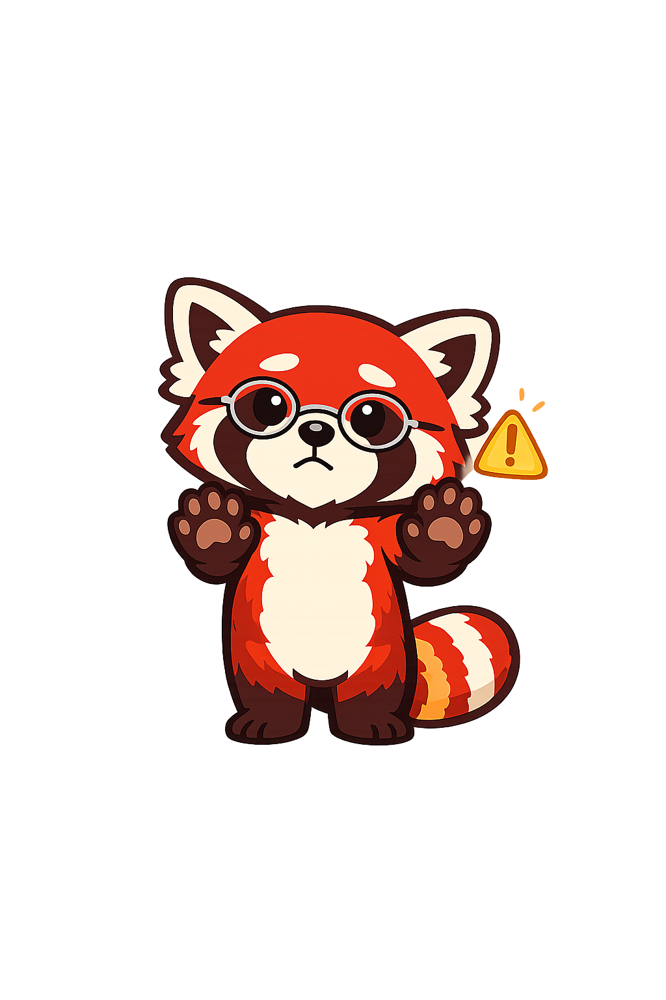
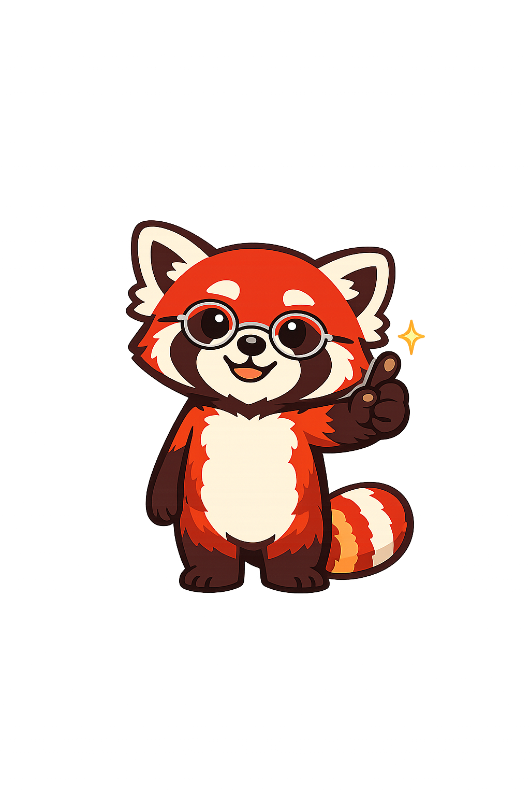

# Mascot Style Guide

This page shows all mascot admonition styles for **Pemba the Red Panda**. Use it to preview rendering after generating the seven mascot images, and as a reference when writing chapter content.

!!! mascot-neutral "A Note from Pemba"
    
    This is the neutral style, used for general sidebars or introductions that don't call for a specific emotional tone. *Every token counts.*

!!! mascot-welcome "Welcome!"
    
    This is the welcome style, used at chapter openings. Pemba waves you in and previews what you'll learn — one welcome admonition per chapter, no more.

!!! mascot-thinking "Key Insight"
    
    This is the thinking style, used for key concepts and insights. Use it 2-3 times per chapter to highlight ideas the reader must internalize.

!!! mascot-tip "Pemba's Tip"
    
    This is the tip style, used for hints and practical advice. The pointing pose signals "here's something useful you might miss."

!!! mascot-warning "Watch Out!"
    
    This is the warning style, used for common mistakes and pitfalls. Concerned but caring — Pemba wants to keep your token bill down.

!!! mascot-encourage "Keep Going!"
    
    This is the encouraging style, used where students may struggle. Reassures the reader that the difficulty is normal and the payoff is real.

!!! mascot-celebration "Well Done!"
    
    This is the celebration style, used at the end of major sections to mark achievement. The dark purple background makes the pale confetti and sparkles in the celebration pose pop.

---

## Notes for Authors

- The mascot image always goes inside the admonition body via `` — never in the title bar.
- Image `src` paths are relative to the rendered page URL. From a chapter page (`chapters/01-.../index.md`) use `../../img/mascot/`. From this page (`learning-graph/mascot-test.md`) use `../../img/mascot/`.
- Cap mascot admonitions at **5–6 per chapter** to maintain pedagogical impact.
- Never place two mascot admonitions back-to-back.
