# List of MicroSims for Token Efficiency

This course has **44 interactive MicroSims** to help students explore token-efficient LLM system design through hands-on simulations, dashboards, and pipeline diagrams.

-   **[A/B Test Outcome Decision Matrix](./ab-test-decision-matrix/index.md)**

    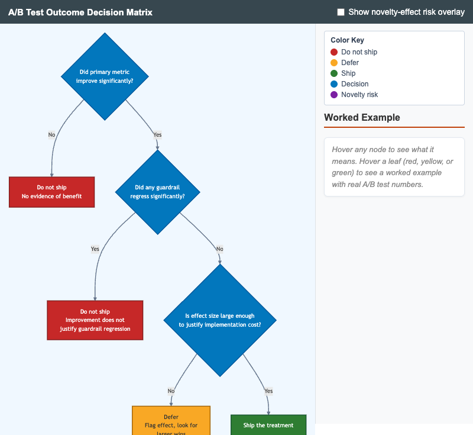

    Interactive decision tree for judging whether to ship an LLM A/B test treatment based on primary-metric improvement, guardrail-metric regression, and effect size.

-   **[Agent Budget Policy with Multiple Limits](./agent-budget-policy-multi-limit/index.md)**

    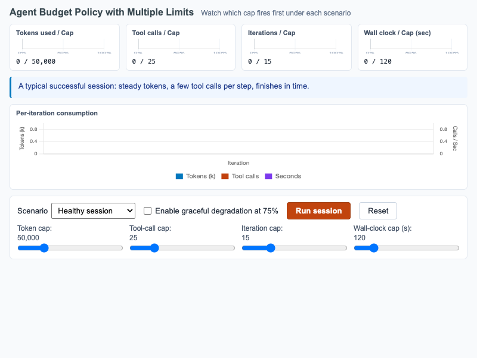

    Multi-meter dashboard showing tokens, tool calls, iterations, and wall-clock budgets firing under healthy and pathological agent scenarios.

-   **[Anthropic Prompt Caching Lifecycle](./anthropic-prompt-caching-lifecycle/index.md)**

    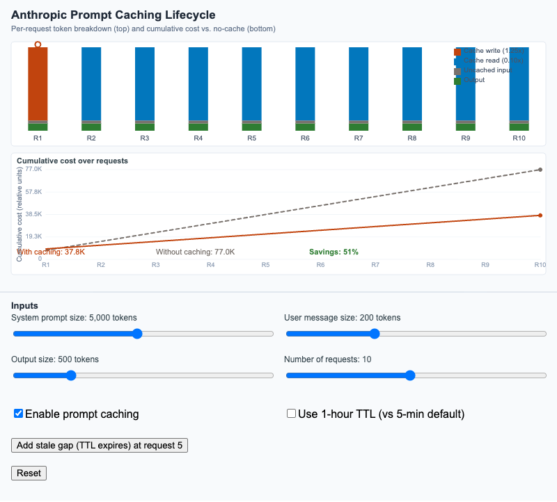

    Visualize per-request token breakdown and cumulative cost across a sequence of requests with and without Anthropic's prompt caching feature.

-   **[Batch Job Lifecycle](./batch-job-lifecycle/index.md)**

    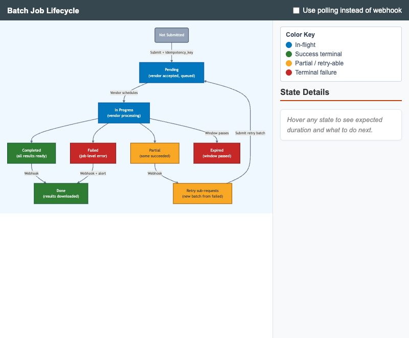

    State diagram of an LLM batch job from submission through download, with idempotency, retry, and webhook vs polling notification paths.

-   **[BPE Tokenization Pipeline](./bpe-tokenization-pipeline/index.md)**

    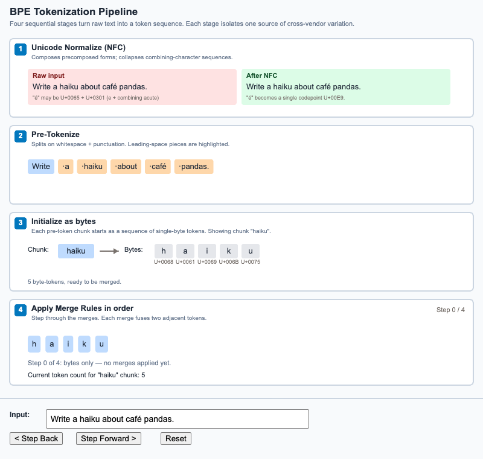

    Step through the four stages a string passes through to become a token sequence - Unicode normalize, pre-tokenize, byte-init, and merge.

-   **[Budget Hierarchy Roll-Up](./budget-hierarchy-roll-up/index.md)**

    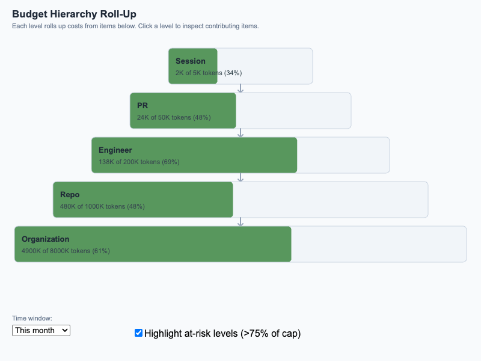

    Pyramid diagram showing how individual session costs roll up through PR, engineer, repo, and organization budgets, with at-risk highlighting at 75%/90%.

-   **[Burn Rate Monthly Forecast](./burn-rate-monthly-forecast/index.md)**

    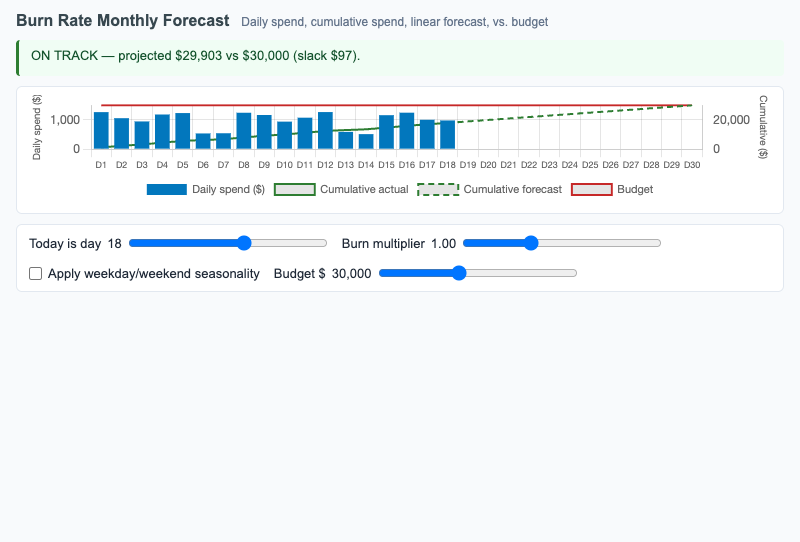

    Daily and cumulative LLM spend with linear forecast extrapolation against a budget line, surfacing whether current spend is on track or over budget.

-   **[Cache Hit Rate Health](./cache-hit-rate-health/index.md)**

    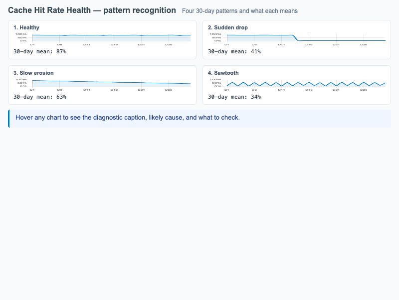

    Four representative cache hit-rate patterns (healthy, sudden drop, slow erosion, sawtooth) with diagnostic captions and remediation hints.

-   **[Cheap-First Cascade with Escalation](./cheap-first-cascade-escalation/index.md)**

    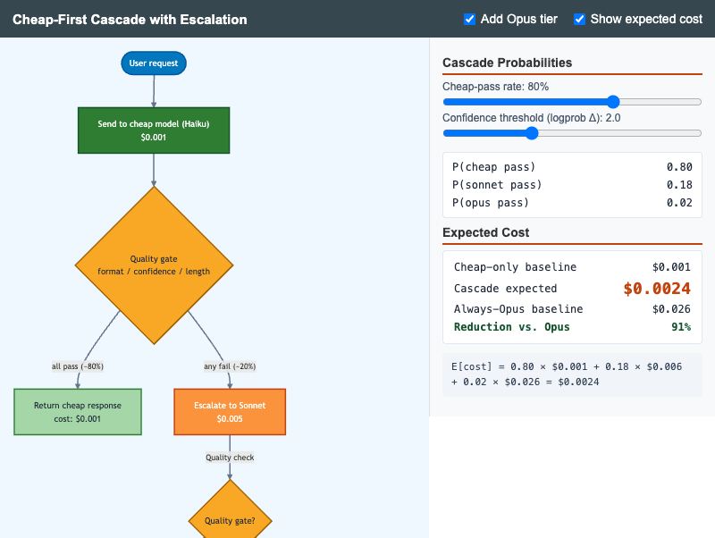

    Flowchart MicroSim showing the cheap-first cascade with quality-gate escalation to Sonnet and Opus, with live expected-cost calculation.

-   **[Context Window Budget Allocation Over a Long Session](./context-budget-long-session/index.md)**

    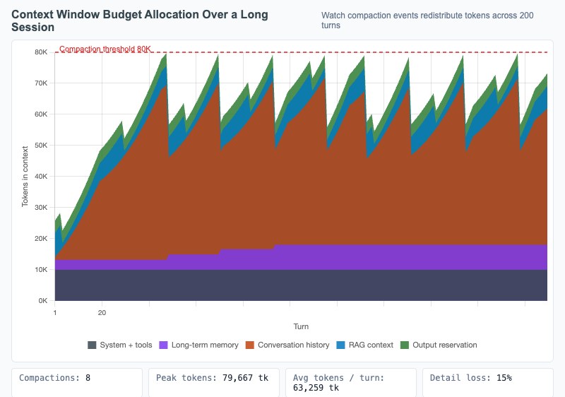

    Stacked area chart showing how the context window is allocated across components over 200 turns, with compaction events visible as drops in conversation-history allocation.

-   **[Continuous Cost Operating Model](./continuous-cost-operating-model/index.md)**

    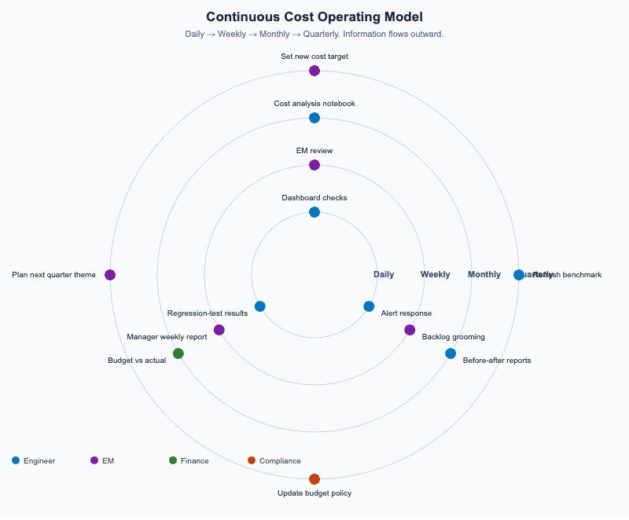

    Concentric rings (Daily / Weekly / Monthly / Quarterly) showing the activities, roles, and artifacts that sustain a long-term LLM cost-optimization program.

-   **[Conversation Message Structure](./conversation-message-structure/index.md)**

    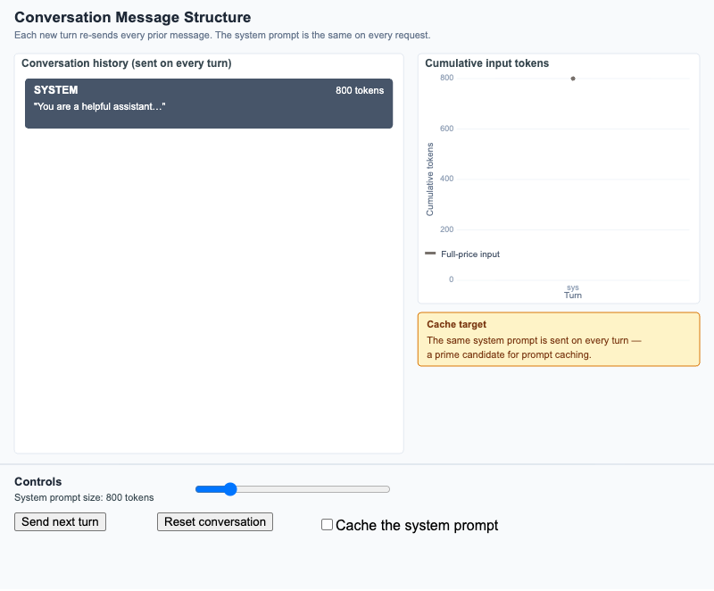

    Watch a multi-turn dialogue accumulate input tokens turn by turn, and see why the system-prompt prefix is the prime caching target.

-   **[Cost Attribution Rollup](./cost-attribution-rollup/index.md)**

    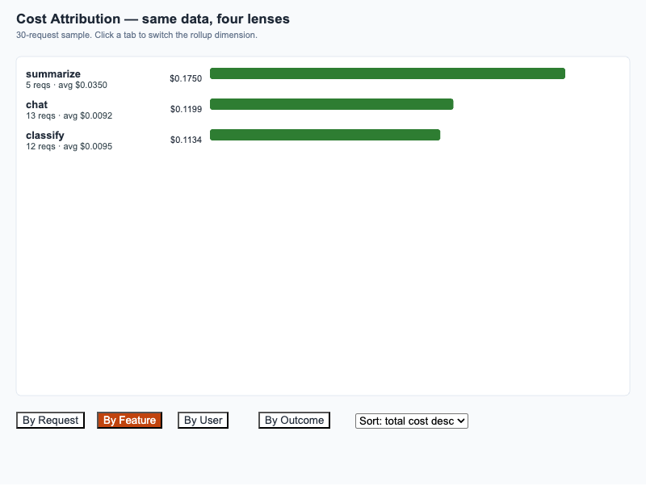

    30-request sample rolled up by Request, Feature, User, and Outcome — same data, four lenses.

-   **[Cost Optimization Loop](./cost-optimization-loop/index.md)**

    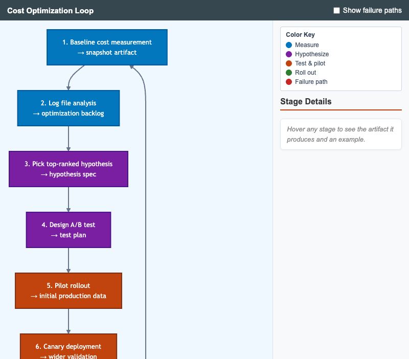

    Circular workflow showing the full cost-optimization cycle from baseline measurement through report and back to the next baseline, with optional failure-path overlay.

-   **[Cost-Quality Pareto Frontier](./cost-quality-pareto-frontier/index.md)**

    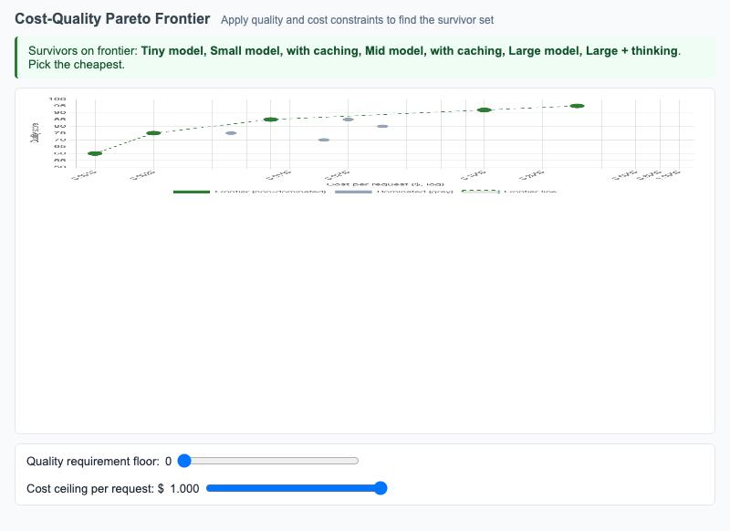

    Scatter plot of model configurations on cost vs quality with the Pareto frontier highlighted; sliders apply quality and cost constraints to find the survivor set.

-   **[Cross-Vendor Caching Comparison](./cross-vendor-caching-comparison/index.md)**

    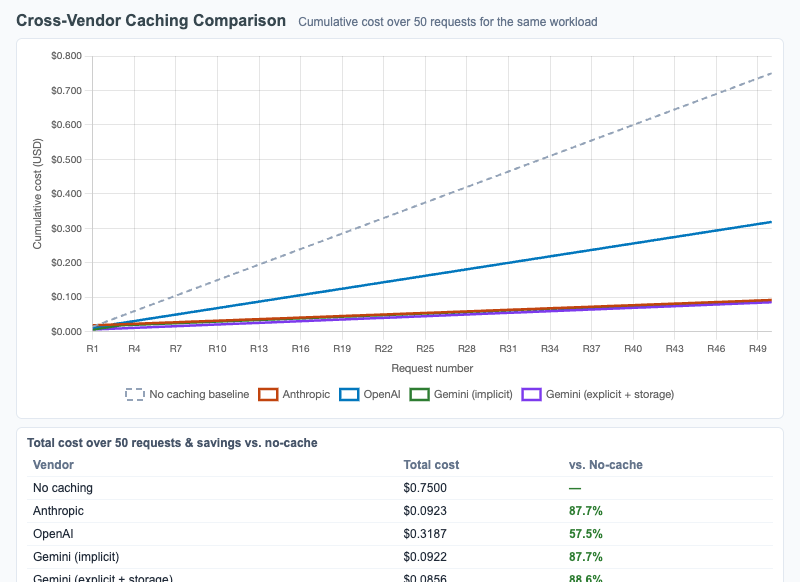

    Multi-line cumulative cost chart comparing Anthropic, OpenAI, and Gemini caching mechanics across 50 requests, with sliders for prefix size, cache lifetime, and request frequency.

-   **[Cross-Vendor Token Count Drift](./cross-vendor-token-drift/index.md)**

    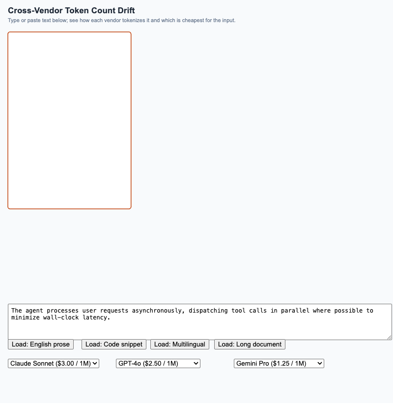

    Side-by-side comparison of how Anthropic, OpenAI, and Gemini tokenize the same input, with a live per-vendor cost calculation that highlights the cheapest option.

-   **[Embedding Space Concept](./embedding-space-concept/index.md)**

    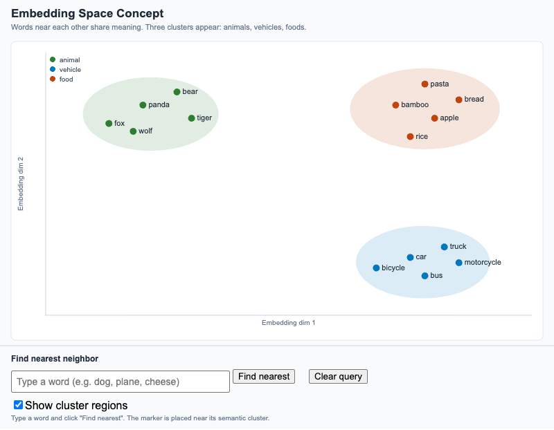

    Visualize how semantically related words cluster in 2D, and use a "find nearest" tool to see why nearness in embedding space means semantic similarity.

-   **[Function Calling Loop with Tool Choice](./openai-function-calling-loop/index.md)**

    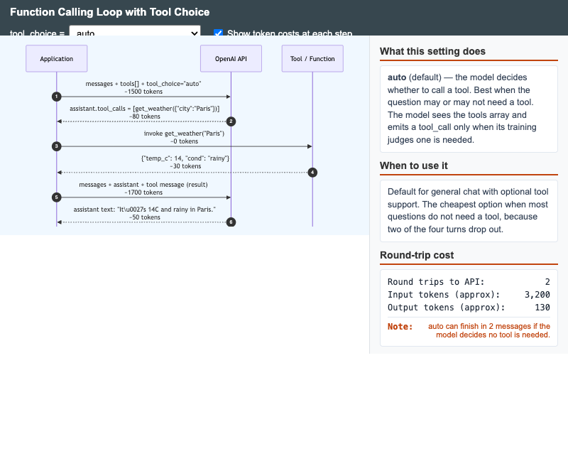

    Interactive sequence diagram showing the OpenAI function-calling round-trip and how each tool_choice setting (auto, none, required, specific) changes the loop shape and token cost.

-   **[Interactive Tokenizer Explorer](./interactive-tokenizer-explorer/index.md)**

    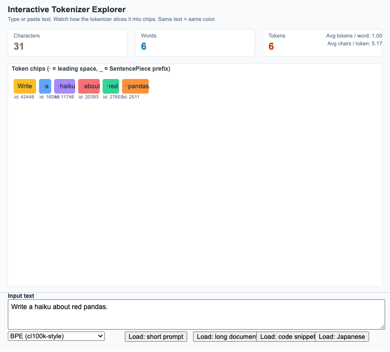

    Type any string and watch a tokenizer break it into chips, with live character / word / token counts and a tokenizer-family toggle.

-   **[Learning Graph Viewer](./graph-viewer/index.md)**

    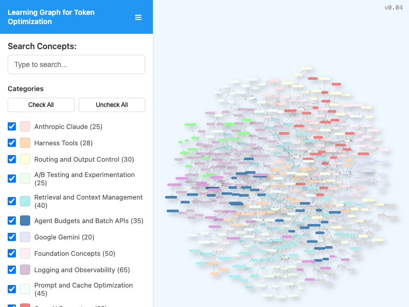

    Interactive viewer for exploring the course learning graph with search, category filtering, pan/zoom navigation, and live node/edge statistics.

-   **[LLM Logging Pipeline with Privacy Filters](./llm-logging-pipeline-privacy/index.md)**

    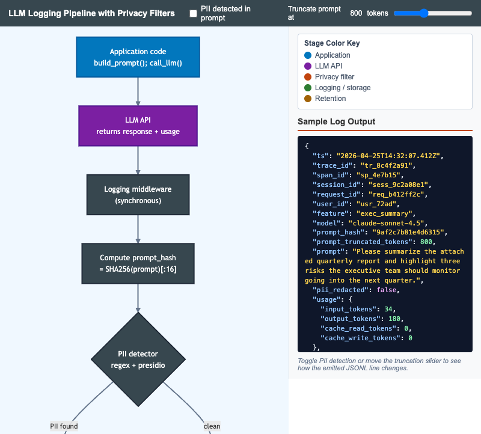

    Interactive Mermaid flowchart that walks an LLM call from application code through PII detection, redaction, cost computation, retention, and storage with a live JSONL log preview.

-   **[LLM Ops Dashboard Layout](./llm-ops-dashboard-layout/index.md)**

    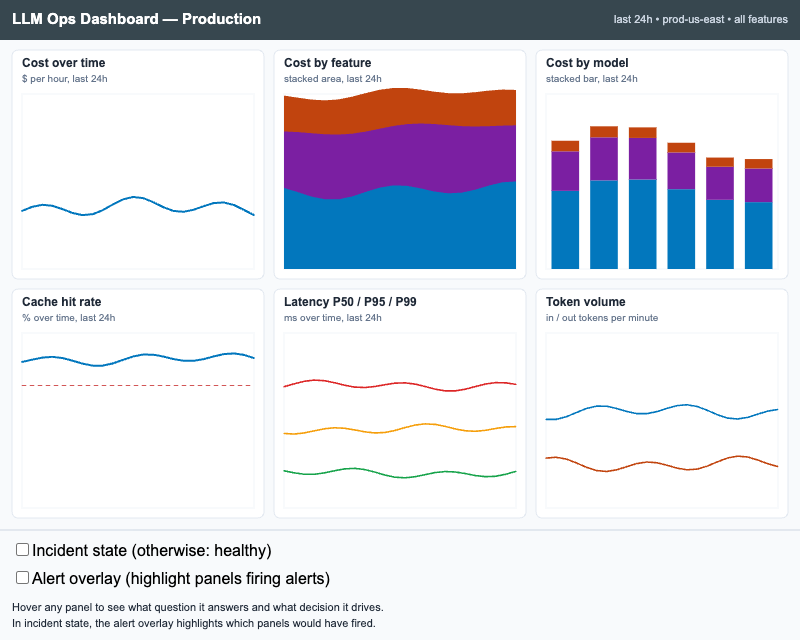

    Interactive p5.js wireframe of a six-panel LLM observability dashboard with healthy and incident states, hoverable panel rationales, and an alert overlay that highlights firing panels.

-   **[Long-Term and Short-Term Memory Architecture](./memory-architecture-long-short/index.md)**

    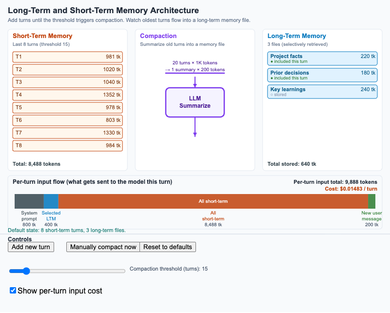

    Three-column diagram showing how short-term conversation turns flow through compaction into long-term memory files, with a per-turn input flow at the bottom.

-   **[OpenAI Token Usage Object Anatomy](./openai-token-usage-anatomy/index.md)**

    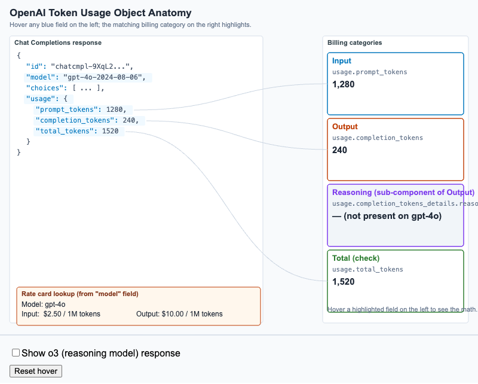

    Hover-labeled anatomy of an OpenAI Chat Completions response showing how each usage field maps to a billing category, including reasoning_tokens for o-series models.

-   **[Output Control Settings](./output-control-settings/index.md)**

    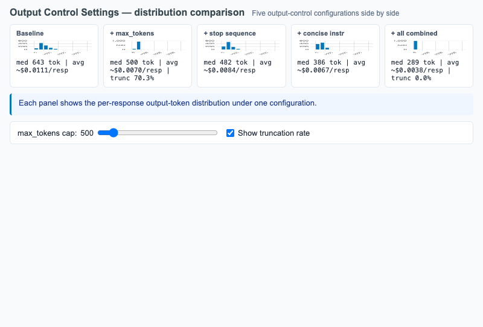

    Five histogram comparison of output token distributions under baseline, max_tokens, stop sequence, concise instruction, and all-combined configurations.

-   **[Pareto Analysis of Per-Feature Cost](./pareto-feature-cost/index.md)**

    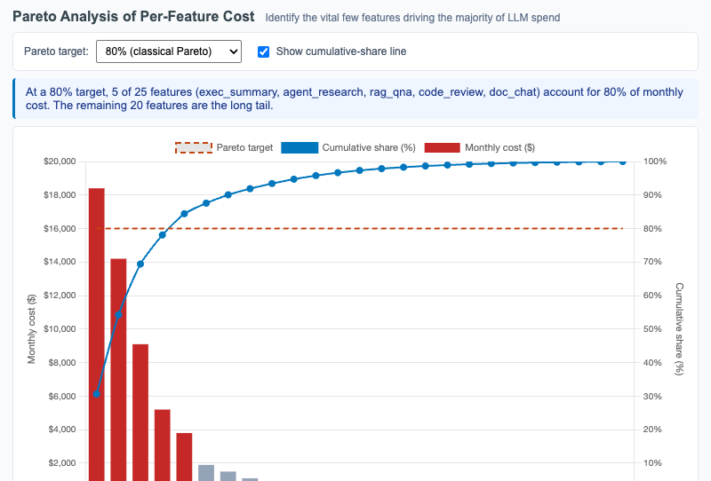

    Interactive Chart.js Pareto chart showing 25 features sorted by monthly LLM cost with overlaid cumulative-share line and adjustable Pareto target threshold.

-   **[Precision/Recall Tradeoff for K Selection](./rag-precision-recall-k/index.md)**

    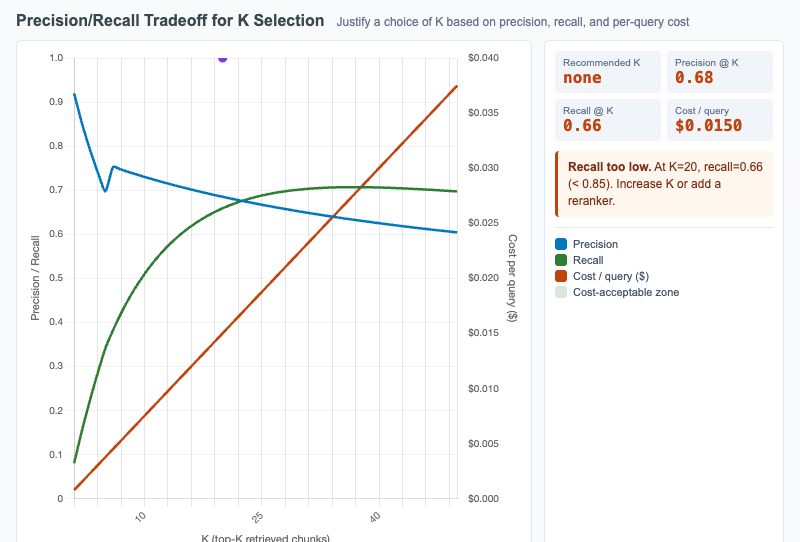

    Plot retrieval precision and recall as functions of K with per-query cost overlaid, so learners can justify the K that balances quality and cost.

-   **[Privacy Compliance Pipeline](./privacy-compliance-pipeline/index.md)**

    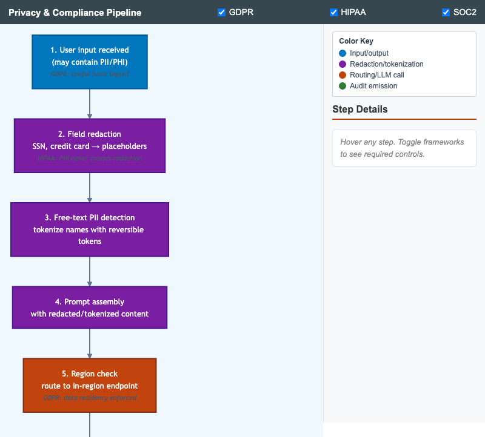

    Vertical pipeline showing the layered privacy and compliance controls a single LLM request flows through, with framework annotations toggleable per regulation.

-   **[Prompt Anatomy Budget](./prompt-anatomy-budget/index.md)**

    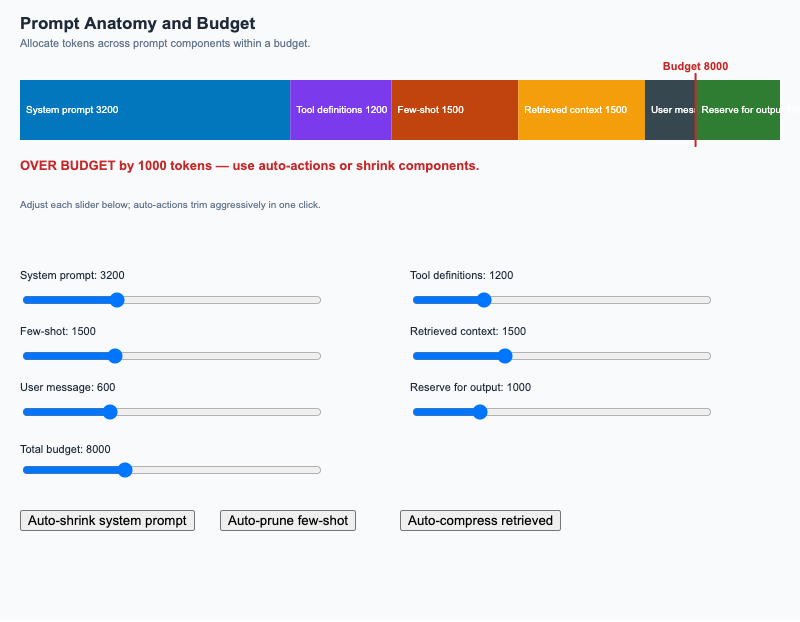

    Stacked bar of prompt components against a budget overlay; sliders adjust component sizes and auto-actions trim aggressively.

-   **[Prompt Trim Before/After](./prompt-trim-before-after/index.md)**

    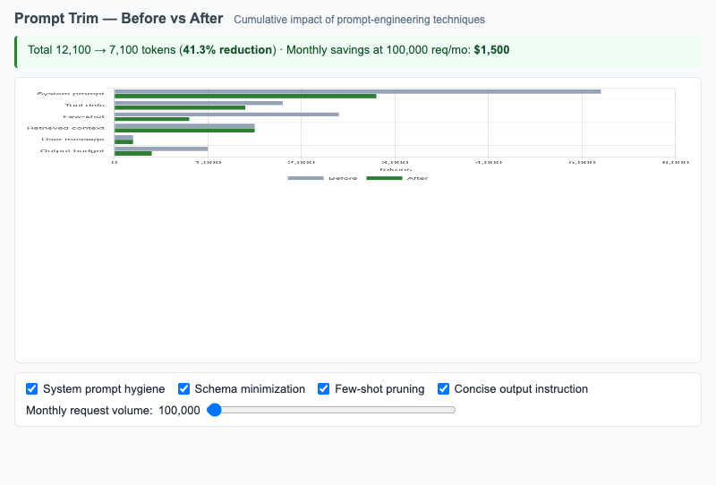

    Grouped horizontal bars comparing token counts per prompt section before and after prompt-engineering techniques, with monthly savings projection.

-   **[RAG Pipeline Cost Annotations](./rag-pipeline-cost-annotations/index.md)**

    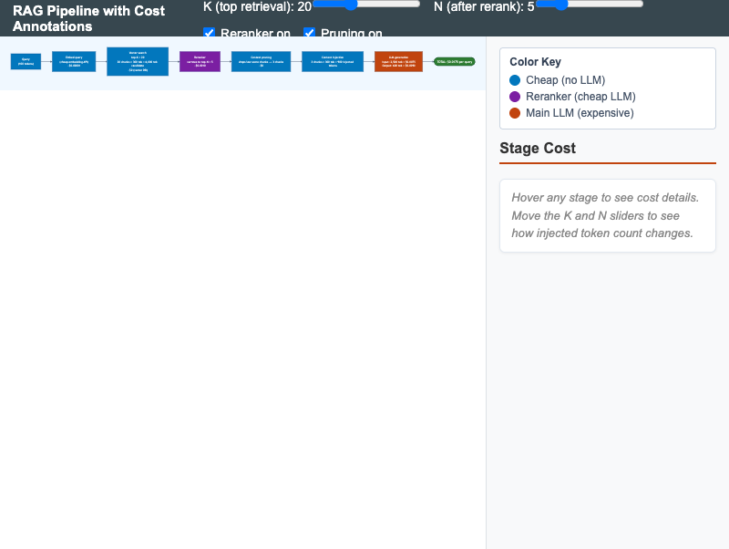

    Horizontal RAG pipeline with live cost annotations at each stage; sliders adjust top-K and reranker N to surface the cost-leverage points.

-   **[Sample Size Calculator for LLM A/B Tests](./ab-test-sample-size-calculator/index.md)**

    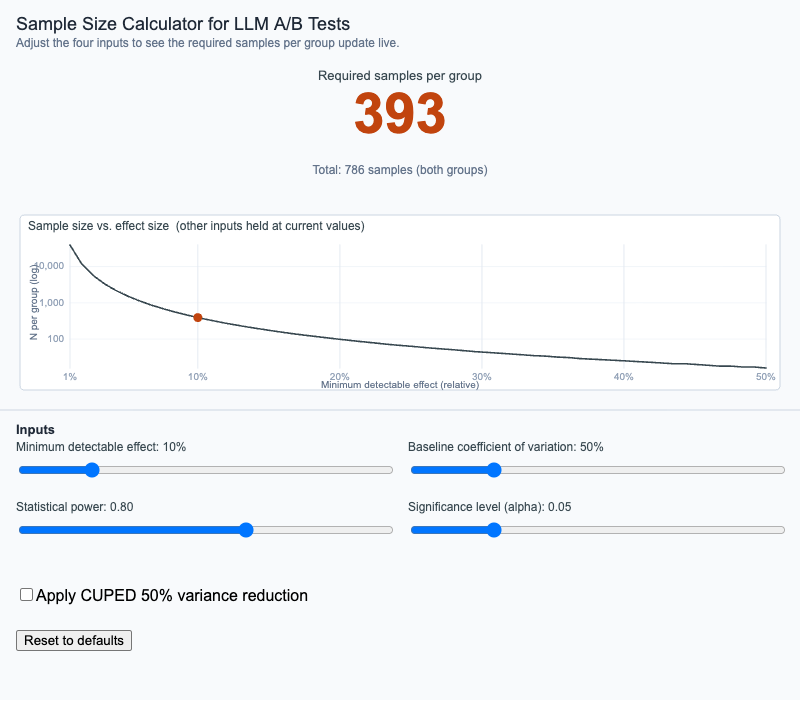

    Adjust effect size, baseline variance, statistical power, and significance level to see the required sample size update live, with optional CUPED variance reduction.

-   **[Sampling Parameter Explorer](./sampling-parameter-explorer/index.md)**

    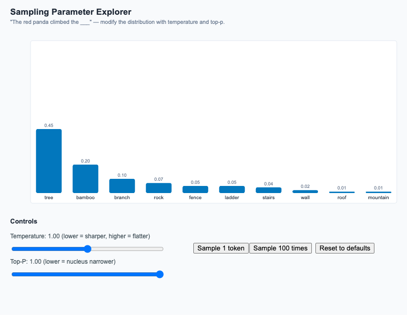

    Adjust temperature and top-p, watch the candidate-token distribution reshape, then sample once or 100 times to see empirical vs theoretical frequencies.

-   **[Serial vs Parallel Tradeoff](./serial-vs-parallel-tradeoff/index.md)**

    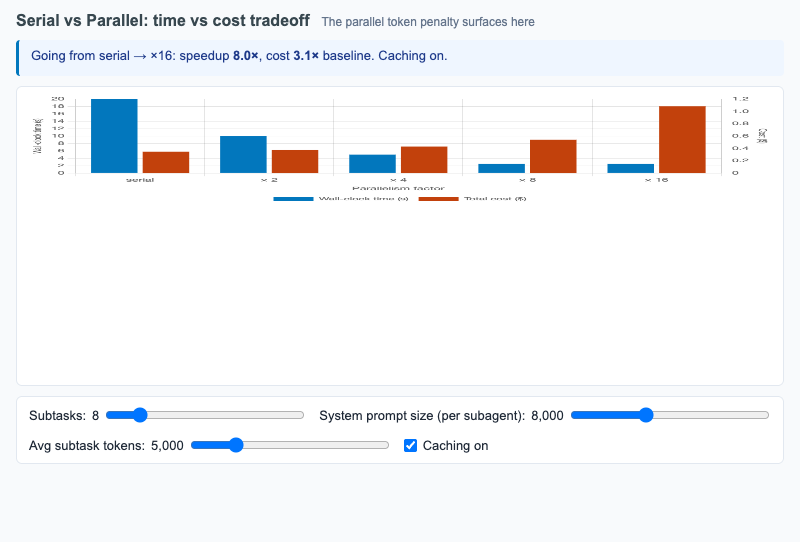

    Dual-axis bar chart of wall-clock time and total token cost as parallelism grows from 1 to 16, surfacing the parallel token penalty.

-   **[Session Token Accumulation](./session-token-accumulation/index.md)**

    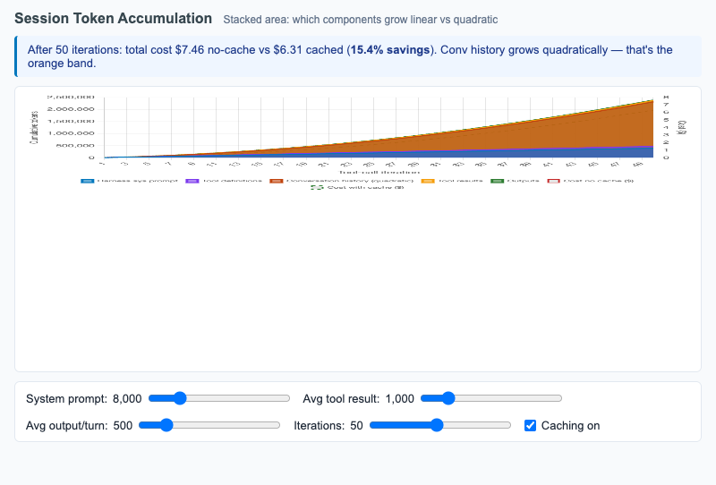

    Stacked area chart showing how harness sessions accumulate tokens turn by turn — surfacing the quadratic growth of conversation history.

-   **[Skill Refactoring Before/After](./skill-refactoring-before-after/index.md)**

    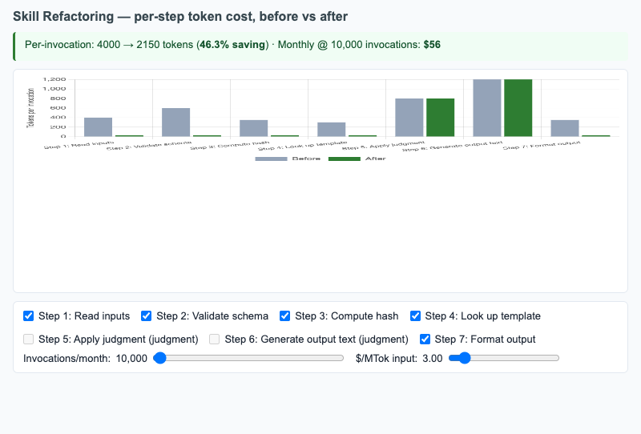

    Per-step token cost of a Skill before and after script-delegation refactor; toggle each step to see the cumulative monthly-savings projection.

-   **[Stable Prefix / Volatile Suffix](./stable-prefix-volatile-suffix/index.md)**

    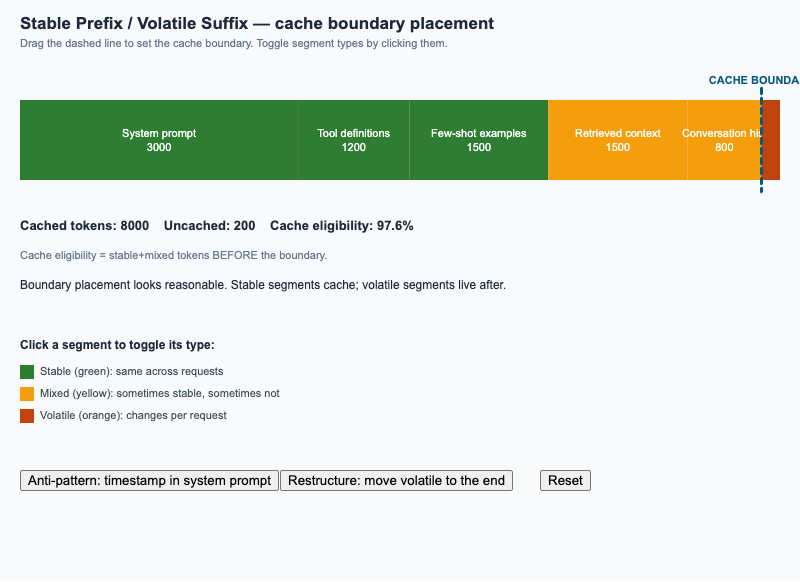

    Drag the cache boundary on a segmented prompt; toggle each segment between stable and volatile; see cache eligibility update in real time.

-   **[Sync, Async, and Batch API Flow](./sync-async-batch-api-flow/index.md)**

    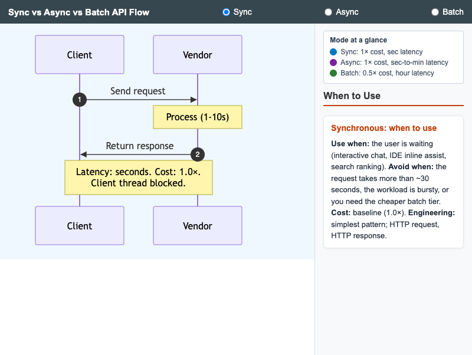

    Three side-by-side sequence diagrams comparing synchronous, asynchronous, and batch LLM API modes with cost and latency annotations.

-   **[Task to Skill Binding Flow](./task-skill-binding-flow/index.md)**

    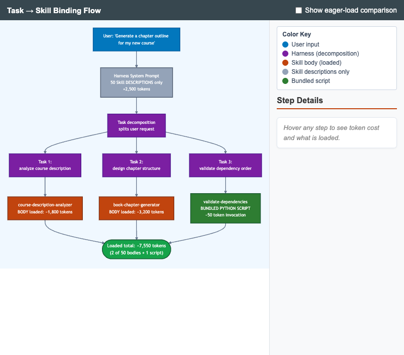

    Diagram of how a harness decomposes a user request into tasks and binds each to a Skill, with token-cost annotations comparing lazy load vs eager load.

-   **[Token Distribution Long Tail](./token-distribution-long-tail/index.md)**

    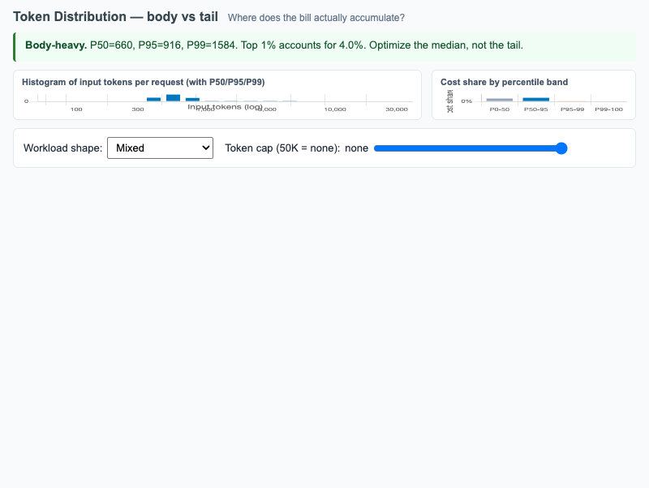

    Histogram of per-request input tokens with P50/P95/P99 markers plus cost-share-by-percentile-band, surfacing whether a workload is body-heavy or tail-heavy.

-   **[Token Lifecycle from Input to Output](./token-lifecycle-flow/index.md)**

    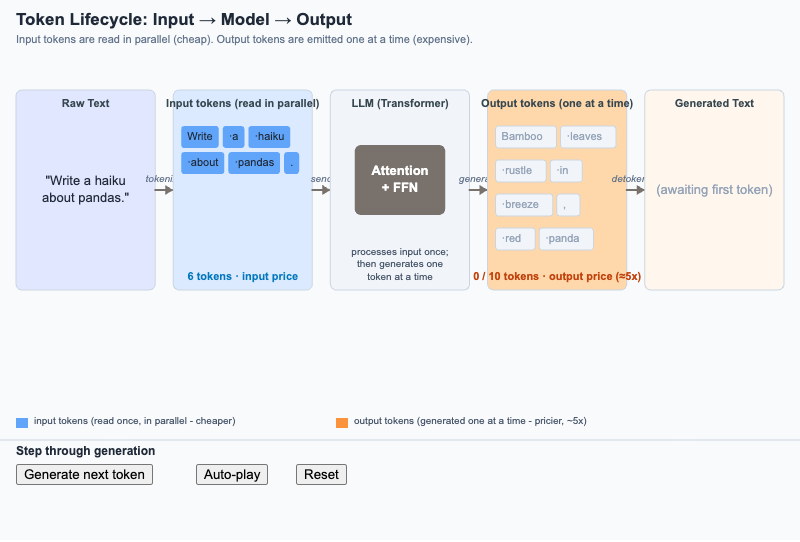

    Step through how raw text becomes input tokens, gets processed once by the model, and is emitted as output tokens one at a time - the asymmetry that drives pricing.

-   **[Token Spike Alert with Drill-Down](./token-spike-alert-drilldown/index.md)**

    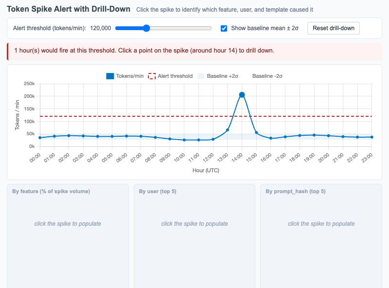

    Interactive Chart.js time series of tokens-per-minute over 24 hours with a click-to-reveal drill-down by feature, user, and prompt template that explains the cause of a spike.

-   **[Tool Use Loop with Cost Annotations](./tool-use-loop-cost/index.md)**

    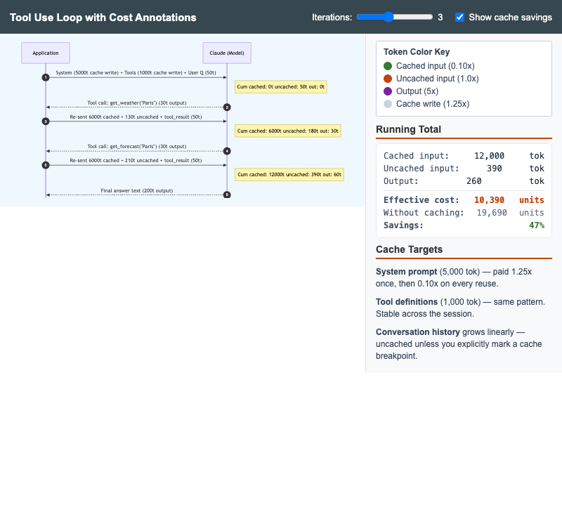

    Multi-turn Anthropic tool-use sequence diagram with cumulative token annotations showing why the system prompt and tool definitions are the highest-value cache targets.

