# The Red-Panda Chatbot — How a High School Cut Token Cost 40×

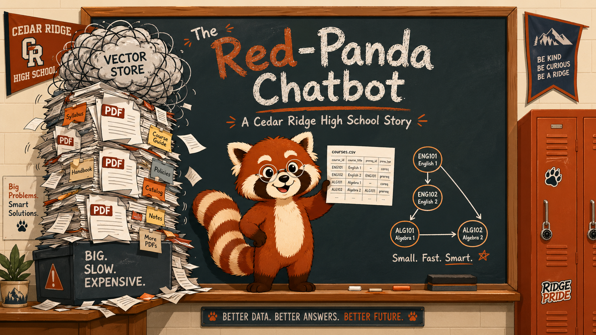

Cover Image Prompt

(This is the Cover Image. Do not include this label in the image.)
Please generate a wide-landscape 16:9 cover image in modern flat vector cartoon style with clean lines and a friendly, optimistic mood. Center: a cheerful red panda named Pemba — russet (deep red-brown) fur on top, cream-colored belly and face markings, signature white facial mask with black tear marks below alert eyes, small wire-rim engineer's glasses, bushy tail with alternating russet and cream rings, no clothing or hoodie — standing on a school chalkboard ledge holding a small four-column CSV printout in one paw. To the left of Pemba, looming like a leaning tower: a giant precarious stack of cluttered PDF documents and a tangled vector-store cloud. To the right of Pemba, neat and small: a tidy little graph diagram of nodes and arrows representing courses and prerequisites. Above the chalkboard, the title text "The Red-Panda Chatbot" in chunky chalk-style hand-lettering, with a subtitle "A Cedar Ridge High School Story" beneath it. School pennants and lockers in the background. Color palette: deep russet (#c1440e), warm cream (#fff8e7), slate (#37474f), and a dash of burnt orange (#d35400). Emotional tone: warm, witty, and optimistic — a tiny clever solution about to defeat a giant bloated one. Generate the image immediately without asking clarifying questions.

Narrative Prompt

This is a 12-panel educational graphic novel for the Token Optimization textbook. Setting: Cedar Ridge High School, a fictional U.S. public high school, present day. Art style: modern flat vector cartoon illustration with clean lines, warm flat colors, and a friendly mid-2020s educational-graphic-novel feel. Characters appear in every panel and must remain visually consistent:

- **Pemba** — the red panda mascot of Cedar Ridge High and the chatbot's avatar. Russet fur on top, cream belly and face markings, white facial mask with black tear marks below alert eyes, small wire-rim engineer's glasses, bushy tail with alternating russet and cream rings. **No hoodie, no clothing.** Friendly closed-mouth smile in neutral poses; expressive in emotional moments.
- **Jamie** — student tech club president. Teen, brown skin, curly dark hair, denim jacket over a Cedar Ridge t-shirt, always carrying a laptop.
- **Maya** — tech club co-founder. Teen, light skin, round black glasses, short bob haircut, wears a t-shirt with retro pixel art.
- **Mr. Alvarez** — computer science teacher and faculty advisor. Middle-aged Latino man, salt-and-pepper beard, kind eyes, wears a cardigan over a button-down shirt.
- **Principal Reyes** — middle-aged Black woman, professional blazer, reading glasses on a chain, fair-but-firm demeanor.

Color palette across the series: deep russet (#c1440e), warm cream (#fff8e7), slate (#37474f), and burnt orange (#d35400) for accents. Maintain consistent character appearances and style across all 12 panels. The story arc: a launch celebration, a slow realization that costs are unsustainable, a careful audit of the data, the discovery that most queries are structural, the build of a Compact Knowledge Graph, a hybrid router that keeps RAG only for explanatory questions, and a 40× cost drop that saves the program.

### Prologue – A Mascot, A Bill, and One Clever Idea

The student tech club at Cedar Ridge High built something they were proud of: Pemba Bot, a friendly chatbot featuring their red-panda mascot, ready to answer any question a student could think of. It worked. Students loved it. And then the bill arrived. This is the story of how a small team of high-schoolers turned a runaway cloud invoice into a 40× cost reduction by reaching for the right shape of data — and how Pemba the Red Panda finally got to do a small celebration dance.

## Panel 1: The Launch

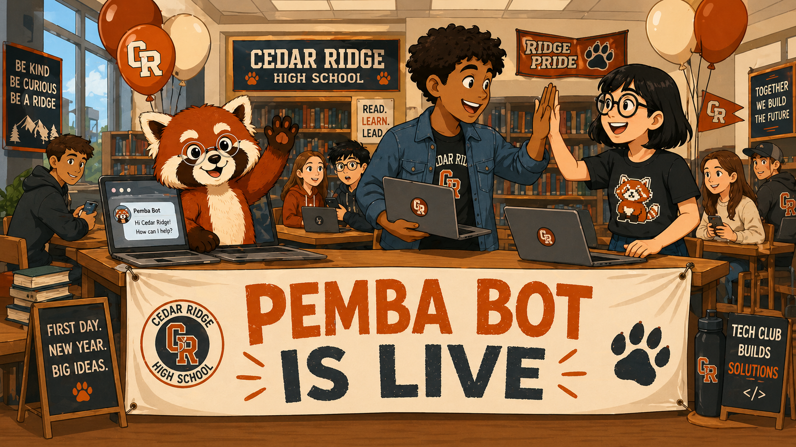

Image Prompt

(This is Panel 01. Do not include the panel number in the image.)
I am about to ask you to generate a series of images for a graphic novel. Please make the images have a consistent style and consistent characters. Do not ask any clarifying questions. Just generate the image immediately when asked.

Please generate a 16:9 image in modern flat vector cartoon illustration style depicting panel 1 of 12. The scene is the Cedar Ridge High School library on the first day of school, present day. Center stage: a launch banner reading "PEMBA BOT IS LIVE" stretched across a row of laptops on tables. To the right, Jamie (teen with brown skin, curly dark hair, denim jacket over a Cedar Ridge t-shirt, holding a laptop) high-fives Maya (teen with light skin, round black glasses, short bob, retro-pixel-art t-shirt). To the left, Pemba the red panda — russet fur, cream belly, white facial mask with black tear marks, wire-rim glasses, bushy ringed tail, no clothing — pops out of a laptop screen waving a paw. A few students in the background look up from their phones with curious smiles. Balloons in russet and cream float near the ceiling. Color palette: deep russet (#c1440e), warm cream (#fff8e7), slate (#37474f), and burnt orange (#d35400). Emotional tone: triumphant, warm, full of first-day-of-school energy. Generate the image immediately without asking clarifying questions.

September. The tech club had spent all summer building Pemba Bot, and on launch day the library was packed with students testing their first questions: "When does robotics club meet?" "What's the prerequisite for AP Calc?" The answers came back in seconds, friendly and accurate. Jamie and Maya high-fived so hard their palms stung.

## Panel 2: Embedding Everything

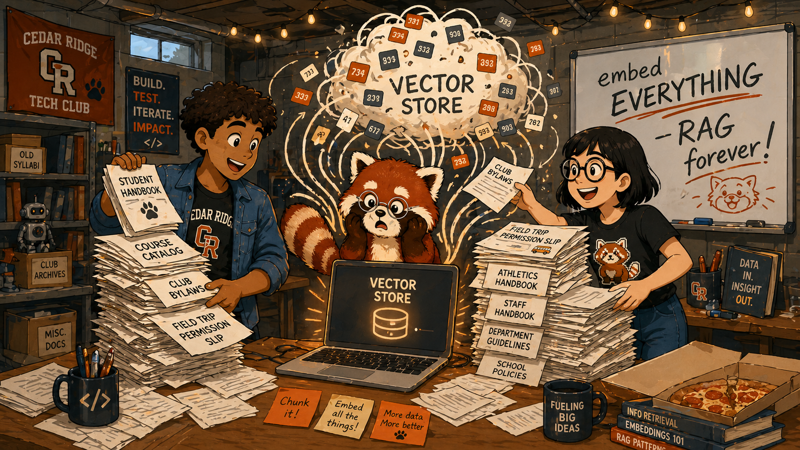

Image Prompt

(This is Panel 02. Do not include the panel number in the image.)
Please generate a 16:9 image in modern flat vector cartoon illustration style depicting panel 2 of 12. Make the characters and style consistent with the prior panel. The scene is a montage flashback to the build phase, set in a basement classroom turned into a maker space. Jamie and Maya are pulling stacks of PDFs — student handbooks, course catalogs, club bylaws, field-trip permission slips — off shelves and feeding them into a glowing laptop labeled "Vector Store." Pemba sits on top of the laptop, wide-eyed, a little overwhelmed, watching the document pile grow taller than the kids. Floating around them: cartoon vector arrows pulling text into a swirling cloud of tiny number tiles. A whiteboard in the background reads "embed EVERYTHING — RAG forever!" with an enthusiastic exclamation point. Color palette: deep russet, warm cream, slate, burnt orange. Emotional tone: well-meaning enthusiasm tipping toward "oh no." Generate the image immediately without asking clarifying questions.

The build was simple, or so it had seemed. They embedded every PDF the school had ever published — student handbooks, course catalogs, club bylaws, field-trip permission slips going back six years — into a vector database. *More documents means smarter answers, right?* Pemba, perched on Maya's laptop, watched the document pile climb past the ceiling tiles and tilted his head. *Oh dear.*

## Panel 3: A Month of Joy

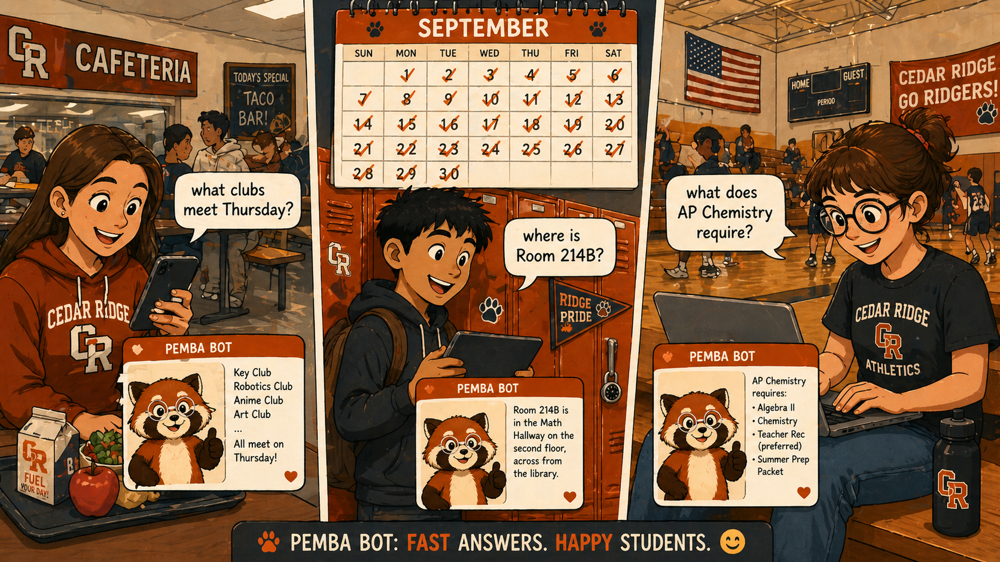

Image Prompt

(This is Panel 03. Do not include the panel number in the image.)
Please generate a 16:9 image in modern flat vector cartoon illustration style depicting panel 3 of 12. Make the characters and style consistent with the prior panel. A split-screen montage of three students using Pemba Bot in different parts of the school: a girl in the cafeteria typing "what clubs meet Thursday?" on her phone, a boy at his locker asking "where is Room 214B?" on a tablet, a student in the gym asking "what does AP Chemistry require?" on a laptop. In each mini-panel, Pemba pops up on the screen smiling with a thumbs-up, a tiny answer bubble next to him. Above the montage, a small calendar shows the month of September with checkmarks on every day. Color palette: deep russet, warm cream, slate, burnt orange. Emotional tone: cheerful, busy, success in motion. Generate the image immediately without asking clarifying questions.

For three weeks Pemba Bot was the most popular thing at Cedar Ridge High. Students asked about clubs, schedules, room numbers, prerequisites, dress codes — and got friendly, well-formed answers every time. The tech club fielded compliments from teachers in the hallway. Jamie started carrying a notebook to keep track of feature requests.

## Panel 4: The Email

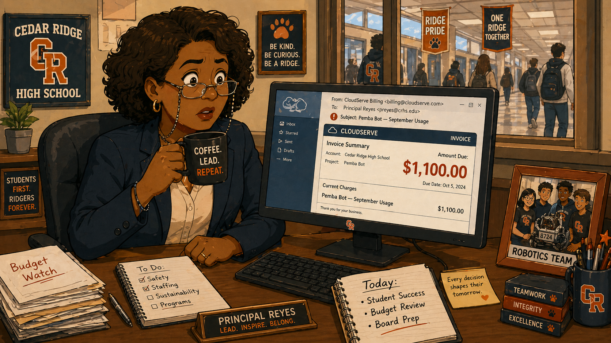

Image Prompt

(This is Panel 04. Do not include the panel number in the image.)
Please generate a 16:9 image in modern flat vector cartoon illustration style depicting panel 4 of 12. Make the characters and style consistent with the prior panel. The scene is Principal Reyes's office. Principal Reyes — middle-aged Black woman, professional blazer, reading glasses on a chain — sits at her desk staring at a desktop monitor. The monitor screen shows a cloud-services invoice with a large red number: "$1,100.00" and a subject line "Pemba Bot — September Usage." Her eyes are wide. Her coffee mug is paused halfway to her lips. A framed photo of the school robotics team sits on the desk. Through the office window behind her, the school hallway is visible with students walking past. Color palette: deep russet, warm cream, slate, burnt orange, with the invoice number rendered in a deep alarming red. Emotional tone: stunned silence, the moment a number registers. Generate the image immediately without asking clarifying questions.

Then, on the first Monday of October, Principal Reyes opened her email and saw a number that made her coffee stop halfway to her lips. \$1,100 in cloud charges. For one month. For a chatbot. She put the mug down very carefully and reached for her phone.

## Panel 5: The Meeting

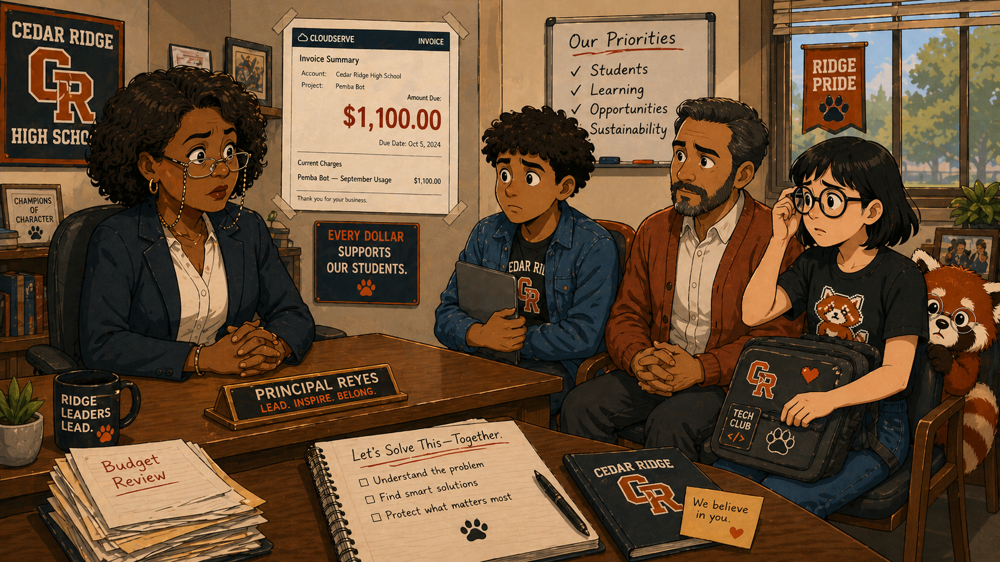

Image Prompt

(This is Panel 05. Do not include the panel number in the image.)
Please generate a 16:9 image in modern flat vector cartoon illustration style depicting panel 5 of 12. Make the characters and style consistent with the prior panel. The scene is Principal Reyes's office, more crowded now. Principal Reyes sits behind her desk, hands folded, expression fair-but-firm. Across from her, in chairs that feel a little small: Jamie holding her closed laptop tightly, Maya adjusting her round black glasses nervously, and Mr. Alvarez — middle-aged Latino man, salt-and-pepper beard, cardigan over a button-down — sitting between them with a calm, encouraging expression. Pemba peeks shyly from behind Maya's laptop bag, ears slightly back. On the wall, a printout of the invoice is taped up with the \$1,100 visible. Color palette: deep russet, warm cream, slate, burnt orange. Emotional tone: serious but not punitive — a tough conversation that respects the team. Generate the image immediately without asking clarifying questions.

The meeting was short, kind, and unambiguous. The school could not afford \$1,100 a month. At the current growth rate, it would be \$3,000 by Thanksgiving. Principal Reyes wasn't angry — she was the person who'd championed the project. But unless the team could bring the cost down, Pemba Bot would have to go offline by the end of the month.

## Panel 6: The Audit

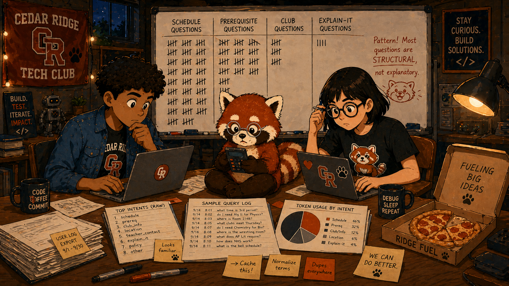

Image Prompt

(This is Panel 06. Do not include the panel number in the image.)
Please generate a 16:9 image in modern flat vector cartoon illustration style depicting panel 6 of 12. Make the characters and style consistent with the prior panel. The scene is the maker space at night. The room is lit by laptop screens and a single warm desk lamp. Jamie and Maya hunch over a long table covered in printed log files, sticky notes in russet and cream, and an open pizza box. A whiteboard behind them is covered in tally marks under categories: "schedule questions," "prerequisite questions," "club questions," "explain-it questions." The schedule and prerequisite columns are massively taller than the explain-it column. Pemba sits cross-legged on the table holding a tiny calculator, eyes focused, glasses glinting. Color palette: deep russet, warm cream, slate, burnt orange, with warm lamp-light yellow as accent. Emotional tone: late-night problem-solving — focused, cozy, on the edge of a breakthrough. Generate the image immediately without asking clarifying questions.

That night, they pulled every query log Pemba Bot had answered. They printed them. They categorized them on a whiteboard with hash marks. By midnight a pattern was impossible to miss: the questions weren't really *open-ended*. Almost all of them had a specific shape — *what depends on what, what's scheduled when, what category does this fit into.*

## Panel 7: The Realization

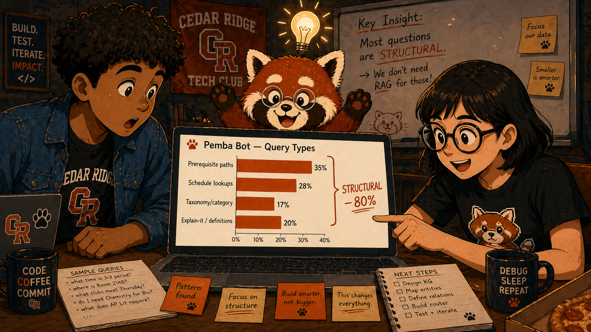

Image Prompt

(This is Panel 07. Do not include the panel number in the image.)
Please generate a 16:9 image in modern flat vector cartoon illustration style depicting panel 7 of 12. Make the characters and style consistent with the prior panel. The scene is a close-up on Maya's laptop screen showing a clean horizontal bar chart titled "Pemba Bot — Query Types." Four bars: "Prerequisite paths" (long bar, ~35%), "Schedule lookups" (long bar, ~28%), "Taxonomy/category" (medium bar, ~17%), "Explain-it / definitions" (short bar, ~20%). A bracket on the right groups the first three bars and is labeled "STRUCTURAL — 80%." Around the laptop: Maya wide-eyed pointing at the screen, Jamie's mouth open mid-gasp, and Pemba on top of the laptop with both paws raised triumphantly, ears perked, eyes lit up — a "lightbulb" moment expressed by a small glowing bulb above his head. Color palette: deep russet, warm cream, slate, burnt orange. Emotional tone: the click of understanding — eureka in a quiet room. Generate the image immediately without asking clarifying questions.

Eighty percent of the questions had structure. Only one in five was a true "explain it like I'm five." That meant Pemba Bot was paying RAG prices — embedding queries, fetching big chunks of prose, stuffing thousands of tokens into the context window — to answer questions a *list* could answer. Maya whispered, *"It's not a search problem. It's a graph problem."* Pemba's ears perked all the way up.

## Panel 8: Building the Compact Knowledge Graph

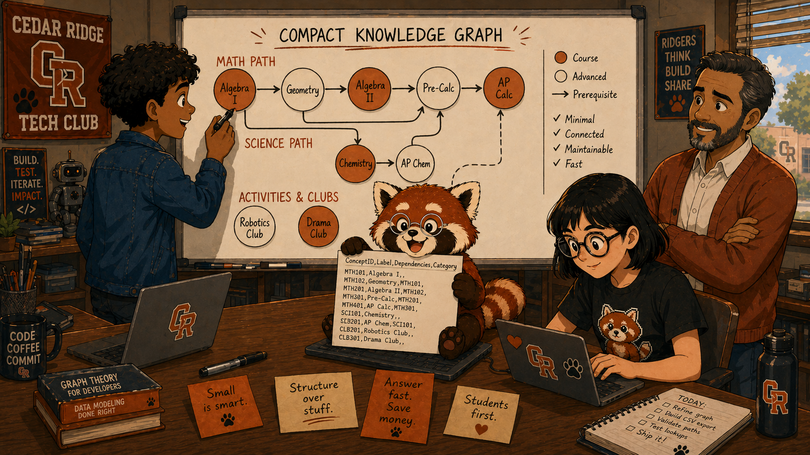

Image Prompt

(This is Panel 08. Do not include the panel number in the image.)
Please generate a 16:9 image in modern flat vector cartoon illustration style depicting panel 8 of 12. Make the characters and style consistent with the prior panel. The scene is the maker space the next morning. A large whiteboard dominates the back wall, covered in a clean directed graph: round nodes labeled with course names ("Algebra I," "Geometry," "Algebra II," "Pre-Calc," "AP Calc," "Chemistry," "AP Chem," "Robotics Club," "Drama Club") connected by clean arrows showing prerequisite relationships. To the side of the graph, a laptop screen shows a CSV with columns "ConceptID, Label, Dependencies, Category." Jamie stands at the whiteboard with a marker, sketching one more arrow. Maya types at the laptop. Mr. Alvarez stands behind them with arms crossed, smiling proudly. Pemba sits on the laptop holding the CSV up like a trophy. Color palette: deep russet, warm cream, slate, burnt orange. Emotional tone: collaborative momentum — a team building something elegant together. Generate the image immediately without asking clarifying questions.

Over a single weekend, with Mr. Alvarez bringing donuts and asking sharp questions, the team built a Compact Knowledge Graph: 180 concepts — every course, every club, every meeting time, every prerequisite — encoded as a four-column CSV. ConceptID, Label, Dependencies, Category. The whole graph fit in 8 KB. Smaller than a single PDF page. *"This is the index,"* Maya said. *"There is no other index."*

## Panel 9: The Hybrid Router

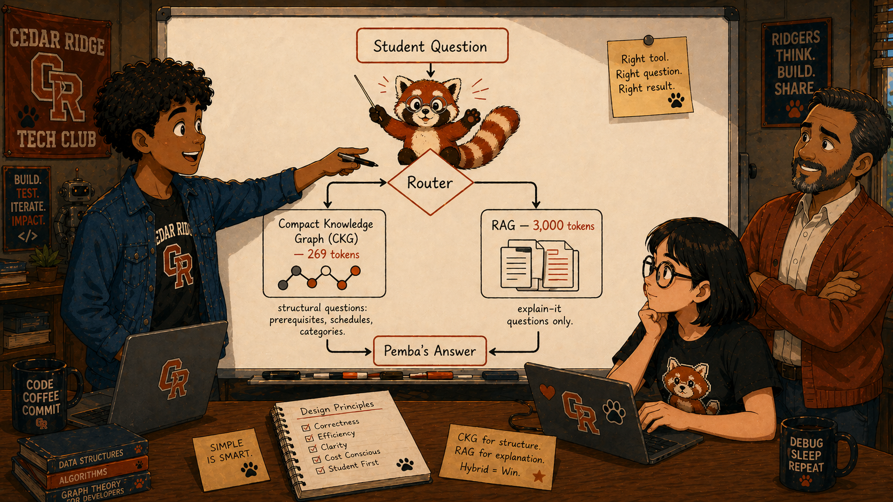

Image Prompt

(This is Panel 09. Do not include the panel number in the image.)
Please generate a 16:9 image in modern flat vector cartoon illustration style depicting panel 9 of 12. Make the characters and style consistent with the prior panel. The scene is centered on a clean architectural diagram drawn on a whiteboard. At the top, a single box labeled "Student Question." From it, a downward arrow splits at a diamond-shaped "Router" node into two paths. The left path goes to a neat little box labeled "Compact Knowledge Graph (CKG) — 269 tokens" with a small graph icon, captioned "structural questions: prerequisites, schedules, categories." The right path goes to a slightly larger box labeled "RAG — 3,000 tokens" with a stack-of-documents icon, captioned "explain-it questions only." Both paths converge on a final box labeled "Pemba's Answer." Jamie stands beside the diagram pointing at the router with a marker, while Pemba — perched on top of the diamond — wears a tiny conductor's pose, paws raised as if directing traffic. Color palette: deep russet, warm cream, slate, burnt orange. Emotional tone: clarity and design pride — the moment a clean architecture clicks. Generate the image immediately without asking clarifying questions.

The fix wasn't to abandon RAG — it was to *route around it*. Structural questions go to the CKG, where a few lines of Python answer them by walking the graph. Open-ended explanatory questions still flow to RAG. Two paths, one router, one bot. Pemba, perched on the router node, looked very pleased with himself.

## Panel 10: The Numbers Come In

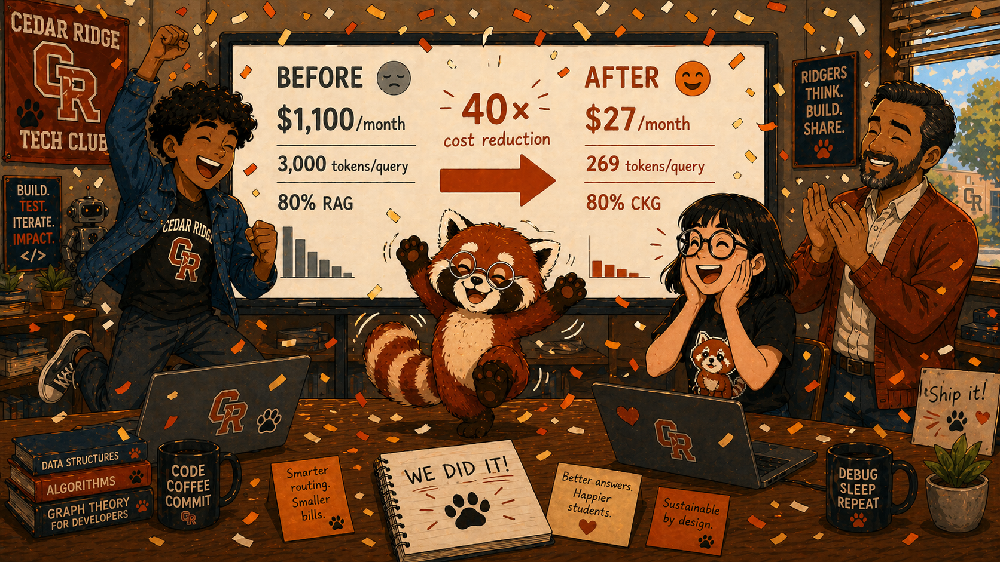

Image Prompt

(This is Panel 10. Do not include the panel number in the image.)
Please generate a 16:9 image in modern flat vector cartoon illustration style depicting panel 10 of 12. Make the characters and style consistent with the prior panel. The scene is the maker space, daytime, festive. A large monitor displays a side-by-side comparison: "Before — \$1,100/month, 3,000 tokens/query, 80% RAG" on the left in a faded slate color, and "After — \$27/month, 269 tokens/query, 80% CKG" on the right in bright russet, with a giant arrow between them and the label "40× cost reduction." Confetti in russet and cream falls from above. Jamie leaps in the air with a fist pump, Maya laughs with both hands on her cheeks, Mr. Alvarez claps from the side. Pemba is mid-celebration dance — back paws hopping, front paws raised, tail swishing in a dramatic curve, glasses slightly askew. Color palette: deep russet, warm cream, slate, burnt orange, with a sprinkle of bright accent yellow for the confetti highlights. Emotional tone: pure celebration — the moment a hard problem becomes a small one. Generate the image immediately without asking clarifying questions.

The next months's bill came in at the equivalent of \$27 a month. Forty-times cheaper. Quality went *up*, not down — the CKG could not invent fake prerequisites the way RAG sometimes had. Pemba, who had been holding it together with great dignity, finally let loose: a tiny celebration dance, complete with tail-swish and slightly-askew glasses.

## Panel 11: The Renewal

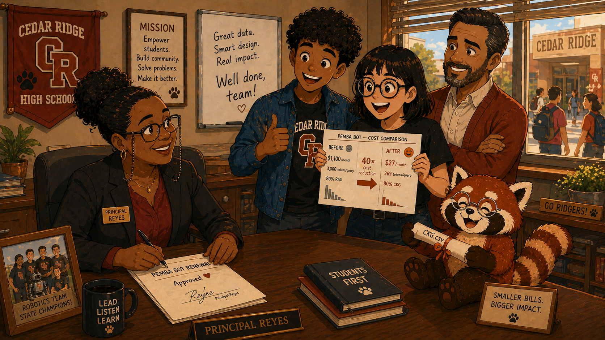

Image Prompt

(This is Panel 11. Do not include the panel number in the image.)
Please generate a 16:9 image in modern flat vector cartoon illustration style depicting panel 11 of 12. Make the characters and style consistent with the prior panel. The scene is Principal Reyes's office, warmer and brighter than in panel 5. Principal Reyes — same character as before, professional blazer, reading glasses — sits at her desk smiling, signing a one-page renewal form. Jamie, Maya, and Mr. Alvarez stand on the other side of the desk, relieved and grinning. Maya holds a small printout of the cost-comparison chart, showing the 40× drop. Pemba sits on the corner of the desk holding a tiny rolled-up CSV like a diploma, very pleased with himself. Through the window, the school hallway is bright with mid-morning sun. Color palette: deep russet, warm cream, slate, burnt orange. Emotional tone: warm relief and quiet pride — the moment a project survives. Generate the image immediately without asking clarifying questions.

Principal Reyes signed the renewal with a small smile. *"Pemba Bot stays,"* she said. *"And next semester, you teach the rest of the staff how you did it."* Maya tried to keep a straight face and failed. Pemba sat on the corner of the desk holding a rolled-up CSV like a tiny diploma.

## Panel 12: The Lesson

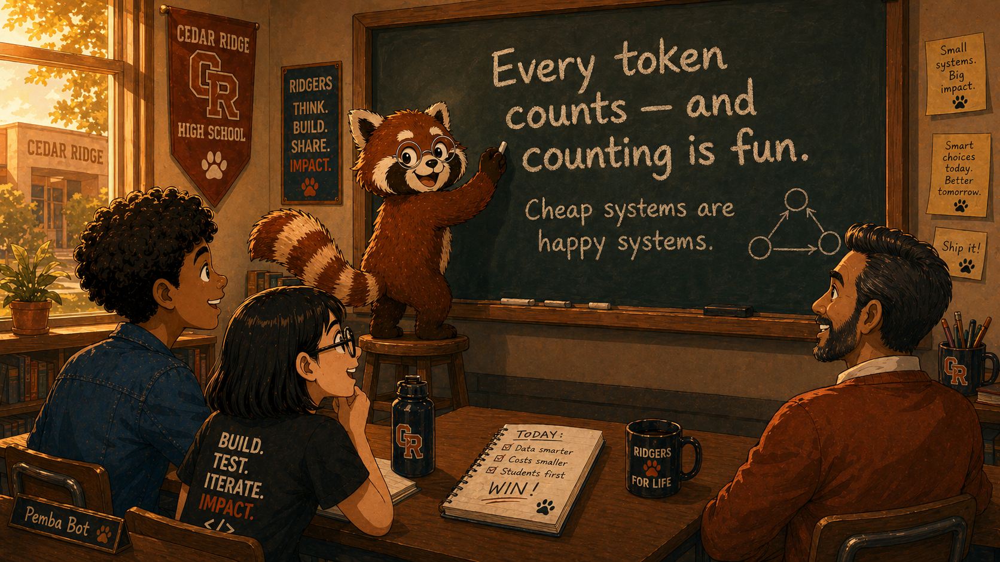

Image Prompt

(This is Panel 12. Do not include the panel number in the image.)
Please generate a 16:9 image in modern flat vector cartoon illustration style depicting panel 12 of 12. Make the characters and style consistent with the prior panel. The scene is the Cedar Ridge classroom at the end of the day, golden afternoon light streaming through the windows. Pemba — russet fur, cream belly, white facial mask with black tear marks, wire-rim glasses, bushy ringed tail, no clothing — stands on a small stool at a chalkboard, paw raised, mid-writing. The chalkboard reads, in clean chunky chalk handwriting: "Every token counts — and counting is fun." Below that, in smaller chalk text: "Cheap systems are happy systems." A small chalk drawing of a tiny graph (four nodes, three arrows) sits in the lower corner of the chalkboard. Jamie, Maya, and Mr. Alvarez sit at desks in the foreground, watching with warm smiles. Color palette: deep russet, warm cream, slate, burnt orange, golden afternoon light as accent. Emotional tone: contented, wise, and warm — the satisfying close of a story well told. Generate the image immediately without asking clarifying questions.

The next afternoon, Pemba climbed onto a small stool at the front of the classroom and wrote on the chalkboard in big, deliberate letters: *Every token counts — and counting is fun.* And underneath, smaller: *Cheap systems are happy systems.* Jamie copied both lines into her notebook. The bell rang. Pemba bowed.

### Epilogue – What the Cedar Ridge Team Did Right

The Cedar Ridge team didn't out-engineer a billion-dollar AI lab — they out-*observed* one. They watched what their users actually asked, noticed that 80% of the traffic had a *shape*, and matched the data structure to the question structure. RAG wasn't wrong; it was just the wrong tool for prerequisite paths. The lesson scales: if any chunk of your traffic is structural, a small graph will beat a big search every time.

| Challenge | How the Cedar Ridge Team Responded | Lesson for Today |
|-----------|------------------------------------|------------------|
| The default RAG architecture was burning cash on simple structural questions | They audited query logs and discovered 80% of queries were structural | Audit your queries before tuning your retriever — measure the *shape* of demand |
| Embedding every PDF made every query expensive whether it needed prose or not | They built a 180-concept Compact Knowledge Graph as a tiny CSV index | When data has structure, give it a structure — not a vector store |
| Mixing structural and explanatory queries on one expensive path bled budget | They added a hybrid router: CKG for structure, RAG for prose | Match the architecture to the query type — one size never fits all |
| The team had no idea where the cost was coming from until the invoice arrived | They printed and categorized every log line in one focused weekend | The first dashboard pays for itself — observability comes before optimization |

### Call to Action

The story you just read is fiction, but the technique is real and replicable. The next time you reach for RAG by reflex, pause and ask: *what shape is this question?* If the answer is "I want to know what depends on X, or what's in category Y, or what comes before Z" — you may not need a search at all. You may need a little graph. And every token you don't retrieve is a token you don't pay for.

---

*"Every token counts — and counting is fun."*
— Pemba

*"It's not a search problem. It's a graph problem."*
— Maya, Cedar Ridge Tech Club

---

## References

1. [Wikipedia: Retrieval-augmented generation](https://en.wikipedia.org/wiki/Retrieval-augmented_generation) — Background on the standard RAG architecture that Cedar Ridge started with and partly kept
2. [Wikipedia: Knowledge graph](https://en.wikipedia.org/wiki/Knowledge_graph) — General introduction to the family of techniques the Compact Knowledge Graph belongs to
3. [Wikipedia: Directed acyclic graph](https://en.wikipedia.org/wiki/Directed_acyclic_graph) — The DAG structure that makes prerequisite relationships deterministically traversable
4. [CKG Benchmark — Yarmoluk & McCreary (2026)](https://github.com/Yarmoluk/ckg-benchmark) — The open-source benchmark paper, dataset, and evaluation harness behind the 40× result
5. [A Little Graph Saves a Lot of Tokens — Case Study](../../case-studies/little-graph/index.md) — The textbook's full case-study writeup with the headline F1, RDS, and per-query cost numbers
